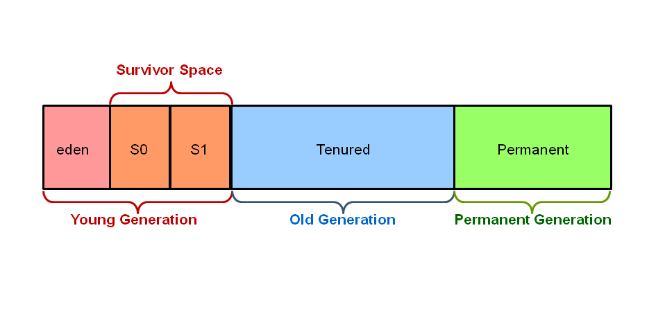

# JAVA Quick Reference

## How to run a java program?
Compile the java program and then run
```java
$>javac HelloWorld.java

$>java HelloWorld
```

## How to debug applications on the server?
1. Use `jdb` to debug
```java
$ jdb -attach localhost:8000 -sourcepath ~/dev/remote/src/main/java/
Set uncaught java.lang.Throwable
Set deferred uncaught java.lang.Throwable
Initializing jdb ...
>
```
2. `jdb` attaches to the process on the port
3. Set breakpoints, view code, print stacktrace using `where`

## How is the heap size set?
- `Xms` specifies the initial memory allocation
- `Xmx` specifies the maximum memory allocation
- JVM will be started with Xms amount of memory and will be able to use a maximum of Xmx amount of memory
```java
//JVM will start with 256 MB of memory and will allow the process to use up to 2048 MB
$>java -Xms256m -Xmx2048m
```

## Explain Garbage Collection (GC)
 [2]
* Garbage collector is a program which runs on the Java Virtual Machine (JVM) to rid of **objects** which are not being used anymore.
* Garbage collection is an **Automatic memory management** scheme so the programmer does not have to worry  about it
* Java objects are created in Heap and Heap is divided into three parts - Young (New) Generation, Tenured (Old) Generation and Permanenet Generation
* Young (New) is further divided into three parts known as Eden space, Survivor 1 and Survivor 2 space. 
* When an object first created in heap its gets created inside Eden space (Young Generation) and after subsequent minor garbage collection if an object survives its gets moved to survivor 1 and then survivor 2 before major garbage collection 
  moves thae object to Tenured generation
* Flags to configure Generation
```
-XX:NewRatio           Ratio of New area and Old area
-XX:SurvivorRatio      Ratio of Eden area and Survivor area
```
* Before removing an object from memory garbage collection thread invokes `finalize()` method of that object and gives an opportunity to perform any sort of cleanup required.
* **Cannot force** garbage collection in Java. Methods like `System.gc()` and `Runtime.gc()` are used to send request but **not guaranteed**
* Mark and Sweep Algorithm `XX:+UseConcMarkSweepGC` is one of the most popular algorithms used for garbage collection. Application is paused for short periods during the collection.
Reference:
1. https://javarevisited.blogspot.com/2011/04/garbage-collection-in-java.html
2. https://stackoverflow.com/questions/3798424/what-is-the-garbage-collector-in-java
 

## What is stack trace?
* Stack trace is a representation of a **call stack** at **a certain point in time**
* Stack trace contains all the methods called (name,file,line#)
* Used for debugging - contains error messages and sequence of calls leading up to the error
* In JAVA exceptions are Chained. Chained Exceptions allows to **relate** one exception with another exception.
* Chained exceptions are sorted by the exception at the **highest level** to the one at the **lowest level**
* Important exception to pay attention to in a long list of chained exceptions is the first one that occurred - often preceded by `Caused by` notation
* Stack trace in JAVA is read bottom up - reverse chronological, most recent operation to earliest operation 
Reference:
1. https://programming.guide/java/stack-trace.html
2. https://www.javaworld.com/article/2073601/ten-tips-for-using-java-stack-traces.html


 


 

