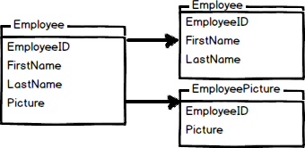

# MySQL: Performance Tuning

## SQL Performance Tuning
* **Index** is a pointer to data in a table. Index is a database is similar to the Index in the back of a book - you can find all pages with reference to a topic
   * Index is stored seperately from the table for which index was created
   * Main purpose of index is to improve performance
   * Index can be created and dropped with **no effect on data**
   * Index types Single-column, Unique and Composite (two or more columns)
   * Index creation may impact performance of insert operations and be avoided on small tables, data is frequently manipulated, columns with high # of NULL values, large batch update processes. 
* **SQL Tuning** is the process of optimally building SQL statements to achieve results
	* Placing the **most restrictive conditions** in the WHERE clause
	* Format SQL for readability
	* Arrangement of tables in the FROM clause - smaller tables followed by larger tables
	* Avoid using LIKE, OR, HAVING, ORDER BY
* **Horizontal and vertical partitioning** [1] 
  * Partitioning is the database process where very large tables are divided into multiple smaller parts - reduce peocessing time and easy maintenance
  * Vertical partitioning splits a table into two or more tables containing **different columns** . Ideal when there is BLOB columns or sensitive information :bulb:  
     
  * Horizontal partitioning divides a table into multiple tables that contain the same number of columns, but fewer rows.
     
* **Views** are virtual tables. View looks and acts like a table as far a user is concerned.
    * View is a predefined query and **does not require physical memory**
    * A view can contain all rows of a table or select rows from a table. 
    * A view can be created from one or many tables - depends on the query that created the view
    * View hides complexity
    * Views can be used as a security mechanism
    * Views can be used to support legacy systems
    * if data changes, view data change!


## SQL Injection  
* Source: https://www.interviewcake.com/article/javascript/sql
* Example:  
  ``` 
  var sqlText = "SELECT * FROM customers WHERE phone = '" + phoneInput + "';"   
  ``` 
  -  phoneInput is provided by user via Browser   
  -  phoneInput = 1' or 1=1;--   
  -  resulting query 1=1 is always true    
  -  -- comments out rest of the SQL   
* Prepare SQL statements **not build dynamic SQL**  - reference [2]
* Validate input
* Sanitize input - escape special characters like " '
* Limit database access
* Don't log messages for end-users . Log messages to log files on the server with severity level.

## References
[1] https://www.sqlshack.com/database-table-partitioning-sql-server/
[2] https://stackoverflow.com/questions/1582161/how-does-a-preparedstatement-avoid-or-prevent-sql-injection
